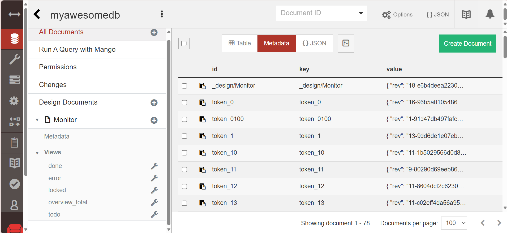
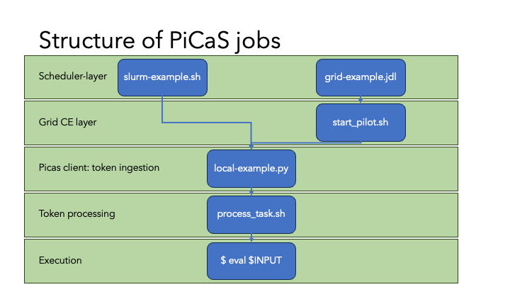

picasclient
-----------

 [](https://github.com/sara-nl/picasclient/blob/main/LICENSE)

Python client using [CouchDB](https://docs.couchdb.org/en/stable/index.html) as a token pool server (PiCaS). PiCaS is a [pilot job framework](https://doc.spider.surfsara.nl/en/latest/Pages/pilotjob_picas.html).


# Installation


## Development & Testing

To install the PiCaS source code for development, first clone this repository and then use [Poetry](https://python-poetry.org/docs/) to install. Poetry is a tool for dependency managing and packaging in Python. If you don't have Poetry, install it first with `pipx install poetry`.
```
git clone https://github.com/sara-nl/picasclient.git
cd picasclient
poetry install --with test
```
Note that Poetry will create a virtual environment if it is not running within an activated virtual environment already. In that case, you will need to run `poetry run` before your commands to execute them within the Poetry virtual environment.

If you prefer not to use Poetry, then you can install PiCaS with:
```
pip install -U .
pip install flake8 pytest
```

To test, run:
```
flake8 picas tests
pytest tests
```


## Installing package

Alternatively, the latest release of PiCaS can be installed as a package from PyPI with:
```
pip install picas
```
You can then write your custom Python program to use PiCaS as a library based on the examples below. 


# Examples

The `examples` directory contains two examples how to use the PiCaS client: a short example and a long example. These also include scripts for running locally, on [Spider](https://doc.spider.surfsara.nl/en/latest/Pages/about.html) (SLURM cluster) and the [Grid](https://doc.grid.surfsara.nl/en/latest/). The examples will show how PiCaS provides a single interface that can store tokens (on the CouchDB instance) with work to be done. Then pilot jobs can be sent to any machine where the PiCaS client can be deployed. Pilot jobs, instead of executing a task directly, contact a central server to be assigned a task and get all the information needed for executing this task.

## Prerequisites

<details closed>
<summary>Get a PiCaS account</summary>
<br>

To run the examples, you need a PiCaS account and access to a database (DB) on the PiCaS CouchDB instance. If you are following a workshop organized by SURF, this has already been arranged for you. If you have a Grid or Spider project at SURF, you can request access through the <a href="https://servicedesk.surf.nl">Service Desk</a>.
</details>


<details closed>
<summary>Connect to the PiCaS server</summary>
<br>

To connect to the PiCaS server, fill `examples/picasconfig.py` with the information needed to log in to your PiCaS account and the database you want to use for storing the work tokens. Specifically, the information needed are:
  
```
PICAS_HOST_URL="https://picas.surfsara.nl:6984"
PICAS_DATABASE=""
PICAS_USERNAME=""
PICAS_PASSWORD=""
```
Note that `PICAS_HOST_URL` can be different if your project has its own CouchDB instance.
</details>


<details closed>
<summary>Create DB Views</summary>
<br>

When you you use the DB for the first time, you need to define "view" logic and create views. <a href="https://docs.couchdb.org/en/stable/ddocs/views/index.html">CouchDB views</a> are the primary tool used for querying and reporting on CouchDB documents. For example, you can create views to filter on new, running, finished, and failed job tokens. Some pre-defined views can be created with:

```
cd examples
python createViews.py
```
This will create the following views:
 * `Monitor/todo`: tasks that still need to be done
 * `Monitor/locked`: tasks that are currently running
 * `Monitor/error`: tasks that encountered errors 
 * `Monitor/done`: tasks that are finished 
 * `Monitor/overview_total`: all tasks and their states
   
After a few moments, you should be able to find the generated views in the <a href="https://picas.surfsara.nl:6984/_utils/#login">CouchDB web interface</a>. Select your database and you will see the views on the left under `Monitor/Views`:


</details>


## Quick example

This example creates fast-running jobs that write a message to standard output.
<details closed>
<summary>Create tokens</summary>
<br>

The file `quickExample.txt` contains three lines with commands to be executed. You can generate three job tokens in the PiCaS DB by running: 

```
python pushTokens.py quickExample.txt
```

Check the DB; you should see the tokens in the view `Monitor/todo`. 
</details>


<details closed>
<summary>Running locally</summary>
<br>

To run the example locally (e.g. on your laptop):

```
python local-example.py
```

If all goes well, you should see output like:

```
-----------------------
Working on token: token_0
_id token_0
_rev 4-8b04da64c0a536bb88a3cdebe12e0a87
type token
lock 1692692693
done 0
hostname xxxxxxxxxxxx
scrub_count 0
input echo "this is token A"
exit_code 0
-----------------------
```

The token in the database will have attachments with the standard and error output of the terminal. There you will find the outputfile `logs_token_0.out`, containing the output of the input command:

```
Tue 31 Dec 2024 00:00:00 CET
xxxxxxxxxxxx
echo 'this is token A'
token_0
output_token_0
this is token A
Tue 31 Dec 2024 00:00:00  CET
```

Once the script is running, it will start polling the PiCaS server for work. A pilot job will not die after it has completed a task, but immediately ask for another one. It will keep asking for new jobs, until all work is done, or the maximum time is up. 

Tokens have a status, which will go from "todo" to "done" once the work has been completed (or "error" if the work fails). To do more work, you will have to add new tokens that in the "todo" state yet, otherwise the example script will just stop after finding no more work to do. If you are interested, you can look into the scripts `examples/local-example.py` and `examples/process_task.sh` to check what the actual work is.
</details>


<details closed>
<summary>Running on a cluster with SLURM</summary>
<br>

You can run this example on a login node of a SLURM cluster, e.g. Spider at SURF. To start the SLURM job which runs the PiCaS client, submit the `slurm-example.sh` script with:

```
sbatch slurm-example.sh
```

Now the work will be performed in parallel by a SLURM job array, and each job will start polling the CouchDB instance for work. Once the work is complete, the SLURM job will finish. You can set the number of array jobs in the script with `--array`. For more information on SLURM job scheduler, see the [SLURM documentation](https://slurm.schedmd.com/).
</details>


<details closed>
<summary>Running on the Grid with DIRAC</summary>
<br>

In order to run this example on the Grid, you need the three [Grid Prerequisites](https://doc.grid.surfsara.nl/en/latest/Pages/Basics/prerequisites.html#prerequisites): User Interface (UI) machine, Grid certificate, VO membership.

On the Grid, you can install software you need either on [Softdrive](https://doc.grid.surfsara.nl/en/stable/Pages/Advanced/grid_software.html#softdrive), download it during job execution, or provide it through the "input sandbox". In this example, we supply the entire environment through the sandbox. The binaries and python code need to be in this sandbox. First we need to create a tar of the PiCaS code, so that it can be sent to the Grid. On you Grid UI, run:

```
tar cfv grid-sandbox/picas.tar ../picas/
```

Secondly, the CouchDB python API needs to be available too, so download and extract it:

```
wget https://files.pythonhosted.org/packages/7c/c8/f94a107eca0c178e5d74c705dad1a5205c0f580840bd1b155cd8a258cb7c/CouchDB-1.2.tar.gz -P grid-sandbox
```

Now you can start the example from the Grid UI with:

```
dirac-wms-job-submit grid-example.jdl
```
In this case [DIRAC](https://dirac.readthedocs.io/en/latest/index.html) is used for job submission. The status and output can be retrieved with DIRAC commands, while in the token you see the token status and the token attachments contain the log files. Once all tokens have been processed (check the DB views) the Grid job will finish. For more Grid-specific information, see the [Grid documentation](https://doc.grid.surfsara.nl/en/latest/index.html).
</details>


<details closed>
<summary>Check results</summary>
<br>

While your pilot jobs process tasks, you can keep track of their progress through the CouchDB web interface and the views we created earlier. 

When all pilot jobs are finished, ideally, you want all tasks to be "done". However, often you will find that not all jobs finished successfully and some are still in a "locked" or "error" state. If this happens, you should investigate what went wrong with these jobs by checking the attached logfiles. Incidentally, this might be due to errors with the middleware, network or storage. In other cases, there could be errors with your task: maybe you've sent the wrong parameters or forgot to download all necessary input files. Reviewing these failed tasks gives you the possibility to correct them and improve your submission scripts. 

You can re-run failed tasks, either by resetting failed/locked tokens or deleting them and creating new tokens, see [Advanced features](#advanced-features). After that, you can submit new pilot jobs.


</details>


## Long example: fractals

To get an idea on more realistic, longer running jobs there is also a "fractals" example. The fractals code will recursively generate an image based on parameters received from PiCaS. The work can take from 10 seconds up to 30 minutes per token.


<details closed>
<summary>Create tokens</summary>
<br>
To add the fractals job tokens to your DB, run:

```
./createTokens
>>> /tmp/tmp.abc123
```
This will generate an outputfile, in this case called `/tmp/tmp.abc123`. Pass the outputfile to the `pushTokens.py` code:

```
python pushTokens.py /tmp/tmp.abc123
```
Now the tokens are available in the database. 
</details>


<details closed>
<summary>Prepare code</summary>
<br>
Next, the binary for the fractal calculation needs to be built:
  
```
cc src/fractals.c -o bin/fractals -lm
```

And finally, the `process_task.sh` code needs to call a different command. Replace:

```
bash -c "$INPUT"
```
with:

```
bin/fractals -o $OUTPUT $INPUT
```
to ensure that the fractals code is called.
</details>


<details closed>
<summary>Run jobs locally, SLURM cluster or Grid</summary>
<br>

Now, you can run your jobs whichever way you want (locally, SLURM cluster or the Grid), using the general instructions as described above for the quick example!
</details>


<details closed>
<summary>Check results</summary>
<br>

The fractals code will generate an outputfile named `output_token_X`. If the jobs are run locally or on Spider, you can find the outputfile in your work directory. For jobs that are processed on the Grid, you can transfer the outputfile to a remote storage location at the end of your job script `process_task.sh`. To check the results, convert the output file to PNG format and display the picture: 
  
```
convert output_token_X output_token_X.png
display output_token_X.png
```
</details>


## Advanced features


</details>

<details closed>
<summary>Stop criteria</summary>
<br>

In the main program of `local-example.py`, the work is executed by this line:

```
actor.run(max_token_time=1800, max_total_time=3600, max_tasks=10, max_scrub=2)
```
The arguments in this function allow the user to speficy criteria to stop processing:
* `max_token_time`: maximum time (seconds) to run a single token before stopping and going to next token
* `max_total_time`: maximum time (seconds) to run picas before stopping
* `max_tasks`: number of tasks that are performed before stopping
* `max_scrub`: number of times a token can be reset ("scrubbed") after failing
So in our example: if a token is not finished in 30 minutes, the token is "scrubbed" (i.e. reset to "todo"), and the next token will be fetched. If a token is scrubbed more than 2 times, it will be set to "error". Nore more tokens will be processed after one hour or after 10 tokens have finished, whatever happens earlier.

Users can even define a custom `stop_function` (with `**kwargs`) and pass that to `actors.run()`. See for details, `picas/actors.py`.

</details>


<details closed>
<summary>Resetting and deleting tokens</summary>
<br>

To reset tokens in a certain view back to "todo", you can use the script `resetTokens.py`. For example, to reset all locked tokens:

```
python resetTokens.py Monitor/locked
```
This will also increase the "scrub_count" of the tokens. Optionally, one can provide a locktime argument. For example, to reset tokens that have been locked more than 24 hours, run:

```
python resetTokens.py Monitor/locked 24
```

If you want to delete all the tokens in a certain view, use the script `deteleTokens.py`. For example, to delete all the tokens in "error" view, run:

```
python deleteTokens.py Monitor/error
```
</details>

<details closed>
<summary>Change iterator</summary>
<br>

Normally, if there are no more tokens in the DB to be processed, the pilot job will stop. However, you can tell the pilot job to continue polling the PiCaS server for work untill `max_total_time` has been reached. This is done by uncommenting this line in `local-example.py`, in the function `ExampleActor.__init()`:
```
self.iterator = EndlessViewIterator(self.iterator)    
```

</details>

<details closed>
<summary>Autopiloting</summary>

### Automatically start your client

This example shows how to automatically start a picas client (or pilot) to process tokens from the database.
While this example explicitly shows the case of two types of tokens, that is single-core and multi-core work, you can adjust the code to:
 - Run for a single view, such as your default tokens.
 - Add more than the 2 views, to process as many types of tokens as you want (where type could also be GPU, high-memory, or other properties of a job).
 - Add properties to the tokens in your "pushTokens" code, such as 
    - "gpu: 1" and start a GPU-based job
    - "time: 72:00:00" and then start a job with a 3-day walltime
    - "cores: 8" and start a high-memory job

This can be achieved by adjusting:
 1. The view code to create all the necessary views
 2. The scanner code to scan these views and submit the necessary jobs
 3. The job scripts (.sh) that end up in slurm / your scheduler
 4. The pilot jobs that scan the views containing the work
 5. Finally, The tokens need to be available in your database

### Running the autopilot

In this example, two types of tokens are to be executed: single-core tokens and multi-core (4 cores) tokens. It is written for a slurm cluster, so the user may have to adjust the code if they want to run it elsewhere. Like the examples in the example folder, a running CouchDB instance is needed.

To run this example, first the design documents for specific resources have to be created. This is explained next, and then the execution of the autopiloting code is shown. 

#### Creating custom made design documents

To select tokens based on some property in the body of the token, we want to create design documents with views that can do so.
This is already present in the `createViews.py` script. Open the script and _uncomment_ the two extra views at the bottom. Then execute:

```
python createViews.py
```

This will create two extra design documents with the same views (todo, error, done, etc.) but with the extra logic added to check for the property `doc.cores`. The documents are called `SingleCore` and `MultiCore`: one for tokens that will use 1 CPU core, and one for tokens that need 4 CPU cores (the number 4 is arbitrary).
The property in the token can be any property you want, in this case we couple it to the number of cores given to the job in slurm. The value should be set to what the job requires and then will be used at execution time.

In the database, these design docs and their views are present and can be used. To push some tokens with the `cores` propery to the database, run:

```
python pushAutoPilotExampleTokens.py
```

If you inspect the `pushAutoPilotExampleTokens.py` script, you will see that the `cores` property is added, and set to either 1 or 4 for this example.
Now we want to select the tokens that have a specific number of cores, and start a picas pilot with these cores, to execute the token body.

#### Running picas with different design documents and views.

To start scanning the different design documents, for example, to execute the work with different numbers of cores, run:

```
python core-scanner.py
```

which will default to view `SingleCore` that was created above and filters on a core count of 1. This is equivalent to running explicitly:

```
python core_scanner.py --cores 1 --design_doc SingleCore
```

To run this with multiple cores and a different design document do:

```
python core_scanner.py --cores 4 --design_doc MultiCore
```

And now your process will start the picas clients needed to evaluate your tokens. The process will check for either single-core tokens and multi-core tokens and start the jobs on the cluster: either for a job with 1 core, or a job with 4 cores, to process the different kinds of work that require differing resources. The number of cores is passed through `core_scanner.py` to sbatch.

This example can be adjusted to use any user defined design document and type of job on a cluster you need. Using different number of cores, GPUs, or other resources can now be done with specified jobs tailor made for each resource.

### Running autopilot on a schedule

To run the scanner on a schedule, one can start it using (in slurm) scrontab, as described in https://doc.spider.surfsara.nl/en/latest/Pages/workflows.html#recurring-jobs and https://slurm.schedmd.com/scrontab.html or other automation tools.

</details>

# PiCaS overview

Below is an overview of the layers in PiCaS and how they relate to the code in the `examples` folder. 
* The scripts `slurm-example.sh` and `grid-example.jdl` are for scheduling jobs on a SLURM cluster and the Grid, respectively. 
* For the Grid, there is an extra script `startpilot.sh` needed to start the job on the Grid Computing Environment.
* Finally, a job is run with `local-example.py` in the same way when tokens are processed locally.


